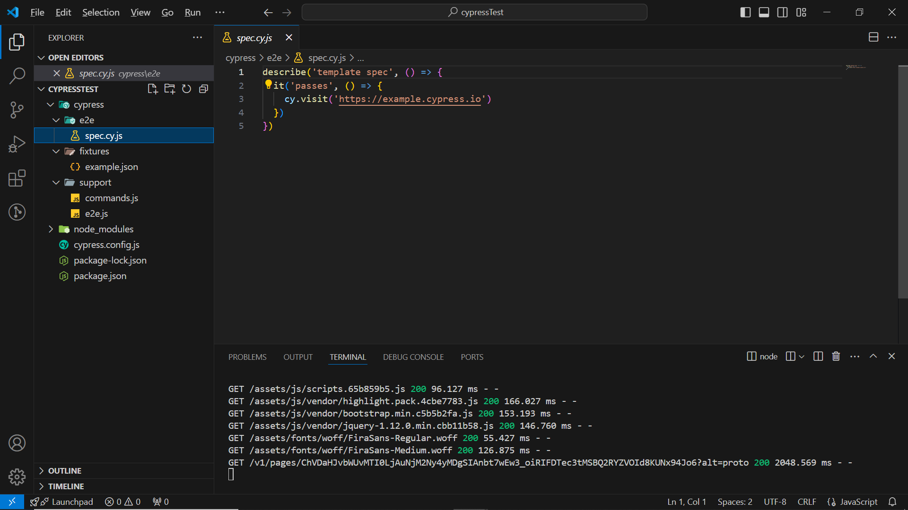

# Cypress with Cucumber framework

Cypress version --> 13.10

## Pre-requisites:
    1. Install Nodejs version between 18 to 20
    2. Install Vs Code
    3. Install "Cucumber (Gherkin) Full Support" extension

## Steps to install:
    1. Clone this repo.
    2. Install the required dependencies using npm install.(Refer package.json for all dependencies)

## Steps to run cypress scripts with Cucumber framework:
    1. Execute "npm run cy:run:web" in terminal to run UI/Web tests.
    2. Execute "npm run cy:run:api" in terminal to run API tests.
    3. Execute "npm run cy:run:regression" in terminal to run UI & API tests.

    Reports:
    1. Please check "cucumberReports/htmlResult.html" file once you have executed the scripts.

## fixtures -> uiTestData.json
    1. Common test data required for web testing will be stored in this json file.

## cucumberReports folder
    1.htmlResult -> This file will have test execution reports in html.
    2.jsonResult -> This file will have test execution reports in json.

## Cucumber Plugin
    @badeball/cypress-cucumber-preprocessor
    @badeball/cypress-cucumber-preprocessor/browserify

## Steps to install package.json and cypress
    1. Execute "npm -i init" to install package.json file
    2. Execute "npm run cypress --save-dev" to install cypress.
    3. Execute "npx cypress open" command and navigate to e2e testing.
    4. Once cypress test runner is launched. you could find a cypress folder with "fixtures" and "support" folder.
    5. Click on create spec in test runner. It will create e2e folder with spec.cy.js file.
    6.  

## Execute Scripts in Headless Mode or Headed Mode
    1. cypress open will launch the test runner and run scripts in headed mode.
    2. cypress run will run scripts in headless mode.

